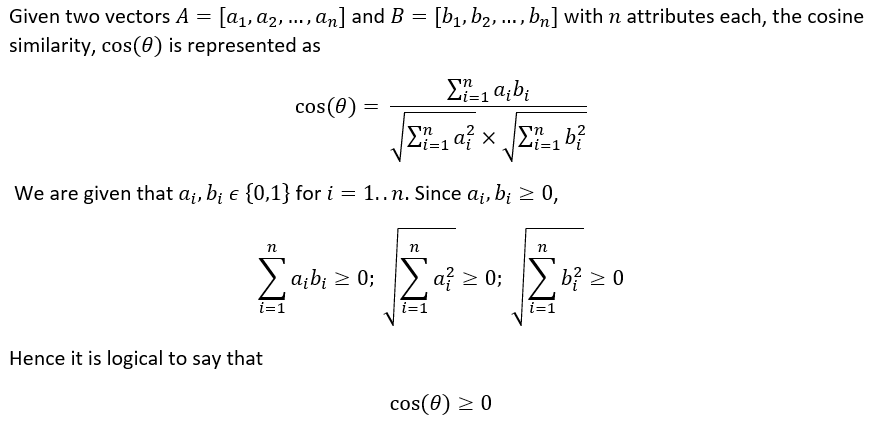

# Movie Recommendation System

Movie Recommender is a Nearest Neighbor item based Collaborative Filtering machine learning recommending system build with the powers of cosine similarities.



# Getting started

**1. Download**

``Git`` is awesome~

```shell
git clone https://github.com/mahmoudahmedd/movie-recommendation-system.git
```

`movies.csv` and `ratings.csv` datasets are under the `data/` folder.

**2. Run**

The configures are in `movie recommender.py`. 

**3. Output**

Here is a example run result, the output log will like this.
```
count   9719.000
mean      10.375
std       22.406
min        1.000
25%        1.000
50%        3.000
75%        9.000
max      329.000
Name: totalRatingCount, dtype: float64
249
Recommendations for Lock, Stock & Two Smoking Barrels (1998):

1: Snatch (2000), with distance of 0.435588419437:
2: Reservoir Dogs (1992), with distance of 0.448722600937:
3: Trainspotting (1996), with distance of 0.502826869488:
4: American Beauty (1999), with distance of 0.51607555151:
5: Goodfellas (1990), with distance of 0.516866981983:
```


